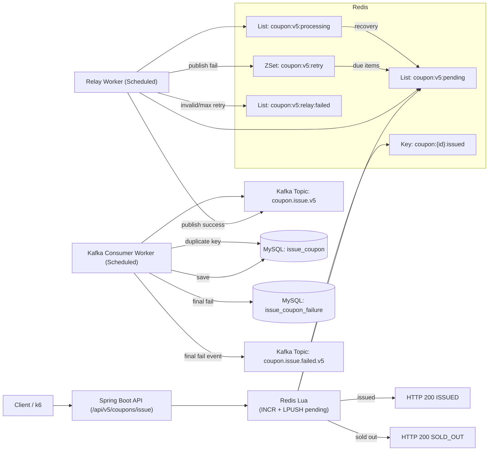

# Coupon Service

선착순 쿠폰 발급 시스템을 버전별로 개선하며, **정합성(초과 발급 방지)**과 **성능(처리량/지연/안정성)**을 단계적으로 검증하는 실험형 프로젝트입니다.

## 프로젝트 의도
- 동일한 도메인(쿠폰 500개 선착순 발급)을 유지한 채 구현 전략을 버전별로 변경
- 각 버전의 병목과 트레이드오프를 성능 리포트로 기록
- 최종적으로 고트래픽 상황에서도 빠르고 안정적으로 발급 처리 가능한 구조를 도출

## 핵심 도메인 규칙
- 쿠폰은 기본 발급 한도 `500`
- 쿠폰 이름(`name`)은 유니크
- 발급 이력(`IssueCoupon`)은 `(userId, couponId)` 유니크 제약
  - 중복 이벤트 수신 시 DB 유니크 충돌을 이용해 멱등 처리

## 버전별 개선 요약

### v1
- 방식: 단순 DB 트랜잭션 처리
- 결과: 동시성 제어 부재로 **500개 초과 발급(4,990건)** 발생
- 관찰: 평균 지연 9.28s, 실패율 85.01%

### v2
- 방식: DB 비관적 락(`PESSIMISTIC_WRITE`)로 정합성 확보
- 결과: **정확히 500건 발급 성공** (정합성 해결)
- 트레이드오프: 직렬화 병목으로 지연/실패율 악화
  - avg 10.04s, p95 28.63s, http_req_failed 98.65%

### v3
- 방식: Redis 원자 카운터 기반 선판정
- 결과(v2 대비): 처리량/지연/실패율 대폭 개선
  - http_reqs/s: `701.39 -> 1,706.21`
  - avg: `10.04s -> 1.07s`
  - p95: `28.63s -> 2.74s`

### v4
- 방식: Kafka 비동기 이벤트 처리(요청-DB 저장 경로 분리)
- 결과(v3 대비): API 핫패스 추가 개선
  - http_reqs/s: `1,706.21 -> 2,387.46`
  - avg: `1.07s -> 110.62ms`
  - p95: `2.74s -> 854.36ms`

### v5
- 방식:
  - Redis Lua 원자 처리: `카운터 증가 + pending 큐 저장`
  - Kafka 릴레이 워커 분리(재시도 기반 발행 보장)
  - Tomcat 동시성 튜닝
- 결과(v4 대비): 처리량/안정성 추가 향상
  - http_reqs/s: `2,387.46 -> 5,511.54`
  - avg: `110.62ms -> 34.71ms`
  - p95: `854.36ms -> 300.9ms`
  - http_req_failed: `1.39% -> 0.00%`

> 상세 수치와 분석은 `test-report/v*/report.txt` 참고

## 기술 스택
- Kotlin 2.2.21
- Spring Boot 4.0.3
- Java 21
- MySQL 8
- Redis 7 (AOF on)
- Kafka (KRaft, single broker)
- Gradle (Kotlin DSL)

## API 버전
- `POST /api/v1/coupons`
- `POST /api/v1/coupons/issue`
- `POST /api/v2/coupons`
- `POST /api/v2/coupons/issue`
- `POST /api/v3/coupons`
- `POST /api/v3/coupons/issue`
- `POST /api/v4/coupons`
- `POST /api/v4/coupons/issue`
- `POST /api/v5/coupons`
- `POST /api/v5/coupons/issue`

요청 예시는 `coupon-service-request.http`에 정리되어 있습니다.

## 실행 방법

### 1) 로컬 빌드/실행
```bash
./gradlew build
./gradlew bootRun
```

### 2) Docker Compose 실행
사전 네트워크 생성:
```bash
docker network create coupon-net
```

실행:
```bash
docker compose up --build
```

## 성능 리포트
- `test-report/v1/report.txt`
- `test-report/v2/report.txt`
- `test-report/v3/report.txt`
- `test-report/v4/report.txt`
- `test-report/v5/report.txt`

각 폴더의 `performance.png`는 K6 결과 캡처입니다.

## 프로젝트 구조
```text
src/main/kotlin/com/example/couponservice
├── domain      # 엔티티/리포지토리
├── v1..v5      # 버전별 controller/service/dto
└── CouponServiceApplication.kt
```

## 아키텍처 다이어그램 (v5 기준)


## v5에서 중요하게 보는 운영 지표
- API: `http_reqs/s`, `http_req_failed`, `p95`
- 릴레이: pending/retry 큐 길이, 재시도 횟수, relay failed 큐 적체
- Kafka: consumer lag
- DB: `IssueCoupon` insert TPS, 중복 충돌 빈도
